# Developer walkthrough — the 2026-06-11 hardening session

A detailed learning guide to three workstreams completed on this codebase:

1. **A multi-tenant bug fix** — the SUPER_ADMIN tenant switcher was silently ignored by onboarding.
2. **A security remediation** — failing dependency audits (SCA), static-analysis findings (SAST), and the CI gates that keep them fixed.
3. **A test-coverage remediation** — un-breaking the test suite, testing the riskiest untested code (auth, payments), and wiring coverage gates.

It is written for someone new to the codebase. Every part teaches the concepts first, then walks the actual code, then extracts the lesson. Diagrams are [Mermaid](https://mermaid.js.org/) — GitHub renders them inline; in VS Code use `Cmd+Shift+V`.

**Contents**

- [Part 0 — Architecture you need before anything else](#part-0--architecture-you-need-before-anything-else)
- [Part 1 — The tenant-switcher bug](#part-1--the-tenant-switcher-bug-data-integrity)
- [Part 2 — Security remediation](#part-2--security-remediation-sca--sast--ci-gates)
- [Part 3 — Test-coverage remediation](#part-3--test-coverage-remediation)
- [Part 4 — The three production bugs, dissected](#part-4--the-three-production-bugs-dissected)
- [Part 5 — The meta-process](#part-5--the-meta-process-how-each-workstream-actually-ran)
- [Appendix A — Run it yourself](#appendix-a--run-it-yourself-command-reference)
- [Appendix B — File map & glossary](#appendix-b--file-map--glossary)

---

## Part 0 — Architecture you need before anything else

### The system

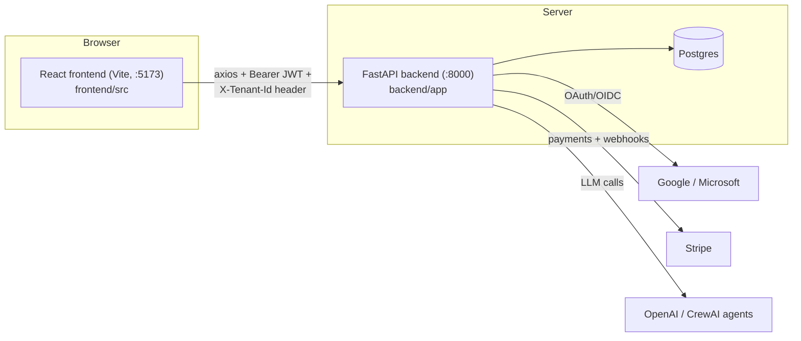

### Backend layering

```
routes/  →  services/  →  repositories/  →  models/ (SQLAlchemy)
(HTTP)      (business      (DB queries)      (tables)
             logic)
```

- **Routes** are thin. They declare FastAPI *dependencies* (`Depends(...)`) for auth, the DB session, and tenant context, then call one service method.
- **Services** hold the business rules — this is where bugs live and where tests aim.
- **Repositories** wrap SQLAlchemy queries (`UserRepository.get_by_email`, `CartRepository.get_or_create_active_cart`, …).
- **Models** define tables. Note a codebase quirk: some Python attribute names differ from column names, e.g. `Order.created_by_user_id` maps to column `created_by`.

### The middleware stack

`app/main.py` builds an onion. **The middleware added *last* wraps *outermost*** — that's why CORS is added last: even errors produced by inner middleware (a 429 from the rate limiter, a 401 from auth) must still carry CORS headers or the browser shows an opaque error.

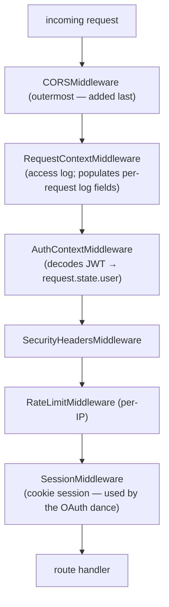

### The JWT (what 'who am I' looks like)

Access tokens are minted by `TokenService.create_access_token` and carry:

```json
{
  "user_id": "…uuid…",
  "email": "user@corp.com",
  "role": "SUPER_ADMIN | ADMIN | USER",
  "user_type": "CELLHUB | COMPANY | VENDOR",
  "tenant_id": "…uuid…",        ← the HOME tenant, fixed at login
  "tenant_type": "CELLHUB | COMPANY | VENDOR",
  "type": "access",              ← vs "refresh" (which carries sid instead)
  "exp": 1781199355
}
```

Two facts that drive Part 1: the JWT's `tenant_id` **never changes mid-session**, and `exp` has **second precision** (two tokens with identical claims minted in the same second are byte-identical — this later bit us in a test).

### Multi-tenancy in one paragraph

One database, many companies ("tenants"). Every business table carries `tenant_id`. Isolation is enforced **in code** (services filter by tenant), with Postgres Row-Level Security available as defense-in-depth (Phase 4, off by default). The CellHub *master tenant* (`00000000-0000-0000-0000-0000000000c1`) is where internal operators live.

---

## Part 1 — The tenant-switcher bug (data integrity)

### Concepts

**Home tenant vs effective tenant.** A `SUPER_ADMIN` can "act as" another tenant via the top-bar switcher. Since the JWT can't change, the frontend attaches a header instead. The axios interceptor (`frontend/src/api/client.ts`) does this for *every* request — but only for super-admins; the store stays `null` for everyone else:

```ts
api.interceptors.request.use((config) => {
  const tenantId = getActiveTenantId();        // null unless SUPER_ADMIN picked one
  if (tenantId) config.headers['X-Tenant-Id'] = tenantId;
  return config;
});
```

**The one authorized seam.** `backend/app/middleware/tenant_context.py` is the *single* place cross-tenant access is authorized. It is deliberately a **pure function + thin FastAPI dependency**, so it's unit-testable without HTTP:

```python
def resolve_tenant_context(requested_tenant_id, current_user, db) -> TenantContext:
    actor_tenant = current_user.get('tenant_id')
    if not requested_tenant_id or requested_tenant_id == actor_tenant:
        return TenantContext(effective_tenant_id=actor_tenant, is_cross_tenant=False)
    if current_user.get('role') != SUPER_ADMIN:
        raise ForbiddenError('Cross-tenant access requires SUPER_ADMIN')      # → 403
    if not TenantRepository(db).get_by_id(requested_tenant_id):
        raise NotFoundError('Tenant not found')                               # → 404
    return TenantContext(effective_tenant_id=requested_tenant_id, is_cross_tenant=True)
```

Routes that participate simply add `ctx: TenantContext = Depends(get_tenant_context)` and use `ctx.effective_tenant_id`. Tenant settings, designs, financing already did this. **Onboarding did not.**

### The bug, in code

Before (route — `backend/app/routes/onboarding.py`):

```python
@router.get('/profile', response_model=OnboardingProfileResponse)
def get_onboarding_profile(current_user: dict = Depends(get_current_user),
                           db: Session = Depends(get_db)):
    service = OnboardingService(db)
    profile = service.get_profile(current_user)          # ← no tenant context at all
```

Before (service — `onboarding_service.py`):

```python
def get_profile(self, current_user: dict):
    self._assert_user_exists(current_user)
    profile = self._get_or_create_profile(current_user['tenant_id'])   # ← always HOME tenant
```

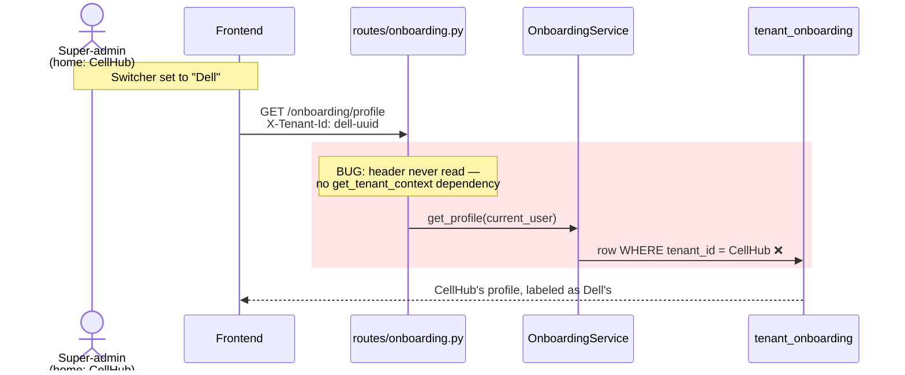

The dangerous variant is the **write**: the operator believes they're configuring Dell, edits the form, hits save — and `PUT /onboarding/profile` overwrites *CellHub's* row. Dell is untouched; CellHub is corrupted. Affected surface:

| Endpoint | Method | Effect of the bug |
|---|---|---|
| `/onboarding/profile` | GET | shows home tenant's data under the selected tenant's name |
| `/onboarding/profile` | PUT | **writes the home tenant's row** |
| `/onboarding/payment/validate` | POST | validates payment on the wrong tenant |
| `/users/me` | GET | `onboarding_completed` reflects home tenant → `ShopShell.tsx` could trap a super-admin in the onboarding wizard |
| quote creation gates | (indirect) | `is_onboarding_complete(home_tenant)` — see "deliberately left" below |

### The fix, in code

After (route):

```python
@router.get('/profile', response_model=OnboardingProfileResponse)
def get_onboarding_profile(
    current_user: dict = Depends(get_current_user),
    ctx: TenantContext = Depends(get_tenant_context),          # ← NEW
    db: Session = Depends(get_db),
):
    service = OnboardingService(db)
    profile = service.get_profile(current_user, effective_tenant_id=ctx.effective_tenant_id)
```

After (service — note the keyword-only param and the fallback):

```python
def get_profile(self, current_user: dict, *, effective_tenant_id: str | None = None):
    self._assert_user_exists(current_user)
    # Effective tenant: the actor's own tenant unless a SUPER_ADMIN has
    # selected another via X-Tenant-Id (resolved upstream in get_tenant_context).
    tenant_id = effective_tenant_id or current_user['tenant_id']
    profile = self._get_or_create_profile(tenant_id)
```

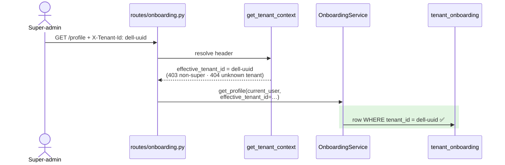

### The five design decisions (and the reasoning to copy)

| Decision | Why |
|---|---|
| **Parameter injection**, not constructor injection — `effective_tenant_id: str \| None = None`, fallback to JWT tenant | Every service here is constructed as `Service(db)`; `QuoteService` even constructs `OnboardingService(db)` internally. The `None` fallback keeps every existing caller *behavior-identical* — a zero-risk migration path. Precedent: `network_design_service.py`. |
| `/users/me` makes **only `onboarding_completed`** tenant-aware; `tenant_id`/email/role stay actor-derived | Identity must not lie. Only the *tenant-scoped derived flag* follows the switcher. |
| `ShopShell` **exempts SUPER_ADMIN** from the forced onboarding redirect | After the `/me` change, switching to an incomplete tenant would force-navigate the operator into that tenant's onboarding wizard on every page — making the switcher unusable for support browsing. The redirect is advisory UX (a localStorage skip flag already existed); real enforcement is the backend quote gate. |
| **Quote gates deliberately left** on the home tenant, with an explanatory comment | The whole quote/cart/pricing write path is home-tenant-bound (`quote_repo.create(tenant_id=current_user['tenant_id'])`). Pointing only the *gate* at the effective tenant would let a super-admin create *CellHub* quotes gated on *Dell's* onboarding — strictly worse. Gate and write path must move together, in a future quotes multi-tenant phase. |
| Audit calls gained `target_tenant_id=tenant_id` | The audit logger auto-fills `tenant_id` from the actor's JWT; a cross-tenant edit would be logged against CellHub. We add the target as a *separate* field — actor vs target stay distinct, neither lies. |

One subtlety we checked before trusting the fix: `update_profile` writes `admin_name` / `admin_email` **only from the request payload**, never from `current_user` — so a super-admin saving cross-tenant writes exactly what is on screen for the target tenant. No contamination risk. *Always check this when making writes cross-tenant.*

### How it was tested

New `backend/tests/test_onboarding_tenant_context.py` (5 DB-integration tests): cross-tenant `get_profile` creates/returns B's row and leaves A untouched; cross-tenant `update_profile` is tenant-scoped; `None` falls back to home tenant; `validate_payment_method` targets B; completing B flips `is_onboarding_complete(B)` (the `/users/me` data path). Authorization (403/404) is **not** re-tested here — the dependency's own pure-logic tests already cover it, and re-testing it per-route would duplicate.

Then verified **live**: logged in as the real super-admin, curled `GET /onboarding/profile` with three different `X-Tenant-Id` values (three different rows returned), did a full cross-tenant `PUT` against a scratch tenant, and confirmed in Postgres the updated row belonged to the target tenant while CellHub's was untouched.

> **Lesson:** in a multi-tenant system, every feature must answer "*which* tenant_id?" explicitly. Audit grep: `current_user['tenant_id']` in any service reachable cross-tenant. And when you find one — fix it with the *established pattern*, not a new one.

---

## Part 2 — Security remediation (SCA + SAST + CI gates)

### Concepts

| Term | What it is | Tool here |
|---|---|---|
| **SCA** (Software Composition Analysis) | Scanning your *dependencies* for published vulnerabilities | `pip-audit`, `npm audit` |
| **SAST** (Static Application Security Testing) | Scanning *your own code* for dangerous patterns | `bandit` |
| **CVE / GHSA / PYSEC** | Vulnerability registries (MITRE / GitHub / Python) | — |
| **Direct vs transitive dependency** | What you pinned vs what came along for the ride | `requirements.txt` has ~18 direct pins; the venv holds 200+ packages |
| **Version pin styles** | `==1.6.4` exact · `>=0.49.1` floor · `~=2.32.5` "compatible release" (≥2.32.5, <2.33) | the `~=` ones caused all our trouble |
| **`# nosec BXXX`** | Inline bandit suppression — always with a justification comment | our false-positive policy |

### The dependency-constraint graph (why this wasn't just "bump versions")

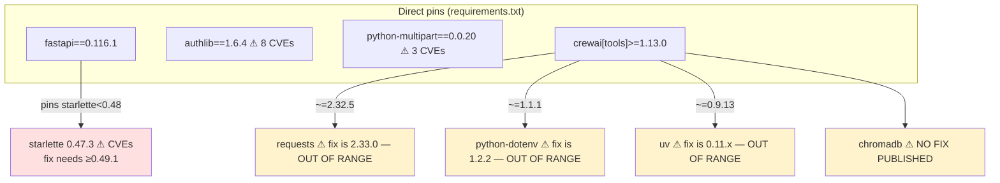

Reading that graph gives you the whole strategy:

1. **Starlette was hostage to FastAPI.** Nothing else pinned it. So the starlette CVE fix *required* bumping FastAPI 0.116 → 0.136 (20 minor versions). Before doing that, a read-only risk survey of the codebase checked: pydantic already v2 ✓ (and **must stay 2.11.x** — crewai pins it); `@app.on_event('startup')` deprecated-but-supported ✓; no deprecated `regex=`/`example=` kwargs ✓; no multipart/upload routes ✓; the 422-handler's use of `RequestValidationError.errors()` to watch ✓. Result: `pip check` clean, all tests pass, starlette landed at 1.3.0.
2. **The yellow boxes cannot be fixed** without breaking crewai. They became **documented accepted exceptions** in `backend/SECURITY_NOTES.md` — package, CVE, why it's stuck, severity, and a re-check trigger ("whenever crewai is bumped"). Security work is partly *deciding and writing down what you can't fix*.
3. **chromadb deserved special handling** (its CVE is pre-auth RCE *on a chromadb server*). We proved non-applicability: zero imports of chromadb anywhere in `app/`; every `Crew(...)` constructed without `memory=`/knowledge/embedder (the only code paths that would start even an embedded client); no chroma process/listener on the host. Accepted-Low, with the explicit trigger: *if crewai memory features are ever enabled, this becomes a release blocker.*

Two tooling traps worth remembering:

- **pip-audit cannot be installed in the app venv** — its `tomli>=2.2.1` collides with crewai's `tomli~=2.0.2`. It runs from a separate env locally and gets its own install in CI. (Noted in `requirements-dev.txt`.)
- **A "-U" upgrade can drag friends along.** `pip install -U uv` also bumped `tomli`/`tomli-w` past crewai's pins. Always run `pip check` after touching the venv.

Frontend was simpler: `axios ^1.11.0 → ^1.16.1` (landed 1.17.0; cleared 4 HIGH advisories — prototype-pollution credential leaks, NO_PROXY bypass, MITM via `config.proxy`), `react-router-dom → 6.30.4` (open-redirect via `//` paths), `npm audit fix` within-major. The remaining moderates (esbuild via vite 5) are **dev-server-only**, not in production bundles; the fix is Vite 8 (a major bump) — deferred to the recorded React-19/Vite-8 workstream.

### SAST: the bandit findings and the suppression policy

9 findings, **zero real vulnerabilities** — but each got a decision, not a shrug:

| Rule | Site | What bandit thought | Reality | Action |
|---|---|---|---|---|
| B608 (SQL injection) | `routes/anam.py` | f-string builds SQL | it builds an **LLM system prompt** for OpenAI | `# nosec B608` + justification |
| B106 (hardcoded password) | `refresh_session_repository.py` | `refresh_token_hash=''` | empty *placeholder*, hash set before persist | `# nosec B106` |
| B105 | `papi_client.py` | `{"token": None}` is a secret | it's an OAuth token *cache structure* | `# nosec B105` |
| B405 (XML attacks) | `network_topology_service.py` | `xml.etree` import | only *builds* draw.io XML, never parses external input | `# nosec B405` |
| B404/B603 (subprocess) | `cdw_agent_service.py` | arbitrary command execution | this was the one real **review**: command comes only from the `CDW_AGENT_COMMAND` server env var (user input goes via child-process *env vars*, not the command line), `shlex.split` + `shell=False`, route gated by `PERM_MANAGE_CATALOG_SYNC` | `# nosec` + full write-up in `SECURITY_NOTES.md` |
| B110/B112 (silent except) | `intake_chat_service.py`, `designs.py` | swallowed exceptions | real code smell — LLM-output JSON parse fallbacks and a row-skip loop | **fixed, not suppressed**: added `logger.debug(...)` / `logger.warning(...)` |
| B110 ×2 (found later) | `request_context.py`, `audit_logger.py` | swallowed exceptions | intentional "logging must never break the request" guards — you can't log from a failing logger | `# nosec B110` + justification |

The policy, codified in `backend/.bandit`: **no rule-wide skips, ever**. Every suppression is inline, narrow, and justified — so a *future* B608 in new code still gets flagged. And note the split: suppress *false positives*, **fix** *real smells*.

One mechanical gotcha: a `# nosec` after the opening line of a triple-quoted f-string becomes **part of the string** (we almost shipped it into the LLM prompt!). For multi-line strings, the comment goes on the **closing** `"""` line.

**Bonus find from the authlib upgrade review** — a latent bug in `routes/auth.py`:

```python
# BEFORE (wrong since authlib 1.0 — `request` lands in the `token` parameter):
userinfo = await oauth.google.parse_id_token(request, token)
# AFTER (matches the correct Microsoft call a few lines below):
userinfo = await oauth.google.parse_id_token(token, nonce=None)
```

It only fired on the rare "token response without userinfo" fallback — which is exactly why nobody had noticed. Upgrades are a great excuse to *read* the call sites.

### The CI gates (and proving they bite)

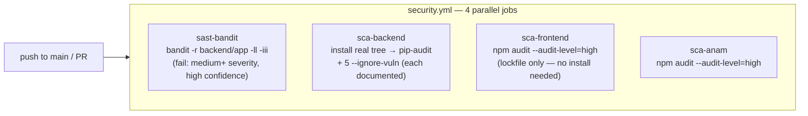

Rules encoded in the workflow:

- Every `--ignore-vuln` flag **must** have a matching entry in `SECURITY_NOTES.md`. The exception list is an artifact, not tribal knowledge.
- `npm audit` needs only the lockfile — no `npm ci` in those jobs (fast).
- We **negative-tested** the gates before trusting them: a planted `subprocess.call(cmd, shell=True)` file → bandit exits 1; a planted `authlib==1.6.4` pin → pip-audit exits 1. *A gate that can't fail is decoration.*

Final scoreboard: backend pip-audit **36 vulns → 5 documented exceptions, 0 high/critical**; frontend **0 high**; anam_ai **0 vulnerabilities**; bandit **0 findings**. Release gate (block on high/critical): **PASS** on all four scans.

> **Lessons:** (1) "Fix the vulns" decomposes into *direct pins / transitive refreshes / constrained exceptions* — draw the constraint graph first. (2) Suppress false positives narrowly and in writing; fix real smells. (3) After any venv surgery: `pip check`. (4) Negative-test your gates.

---

## Part 3 — Test-coverage remediation

### Concepts

- **Line coverage** = % of statements executed by tests. Framework targets: ≥80% backend `services/`+`repositories/`; ≥90% frontend `calculator/`+`suggestions/`.
- **Fixture drift** — tests use hand-built fakes of real models; when models grow fields, fakes silently fall behind and tests fail *for reasons unrelated to what they test*.
- **Ratchet threshold** — wire CI's `fail_under` just below *achieved* coverage and raise it as tests land, instead of wiring the aspirational target and living with red CI.
- **Module-scoped fixture** — built once per test file (`@pytest.fixture(scope='module')`), shared by its tests, torn down at the end.
- **strict xfail** — `@pytest.mark.xfail(strict=True, reason=...)`: the test *documents a bug*; it "passes" by failing, and the suite goes red the moment someone fixes the bug without enabling the test.

### Step 1 — Make the suite trustworthy (28 failures → 0)

You cannot trust a coverage number from a red suite — and indeed, just greening it moved measured coverage **32% → 46%** (the failing DB tests started counting). All three clusters were fixture drift; production code was correct:

**Cluster 1 (9 tests)** — `catalog_service.py` gained `managed_service_price`; the test's `FakeItem` dataclass didn't have it. Fix: one defaulted field.

```python
@dataclass
class FakeItem:
    ...
    attributes: dict = field(default_factory=dict)
    managed_service_price: float | None = None      # ← added
```

**Cluster 2 (11 tests)** — `network_design_service._sync_onboarding_contact()` now reads `profile.duns_number` / `tax_id` / addresses; the `FakeOnboarding` mock (a `type('Profile', (), {...})` stub) only defined 5 of the 13 fields. Fix: add the missing 8.

**Cluster 3 (8 tests)** — the onboarding *completion* check gained an address requirement; the `TenantOnboarding` fixtures seeded everything except `operations_address`, so `is_onboarding_complete()` returned False and the **quote-creation gate** rejected with `"Complete onboarding before creating a procurement request"` instead of the domain errors the tests expected. Fix:

```python
db.add(TenantOnboarding(
    ..., company_setup_completed=True, payment_validation_status='VERIFIED',
    operations_address={'line1': '1 Main St', 'city': 'Austin',
                        'state': 'TX', 'postal_code': '78701'},   # ← added
    billing_same_as_operations=True,                               # ← added
))
```

> Notice the *shape* of cluster 3: the failure message pointed at the onboarding gate, two layers away from what the tests tested. Fixture drift often shows up as someone else's error message.

### Step 2 — The two test patterns (memorize these; you'll copy one for every test)

There is deliberately **no `conftest.py`** — every test file is self-contained, with its own fixture and teardown.

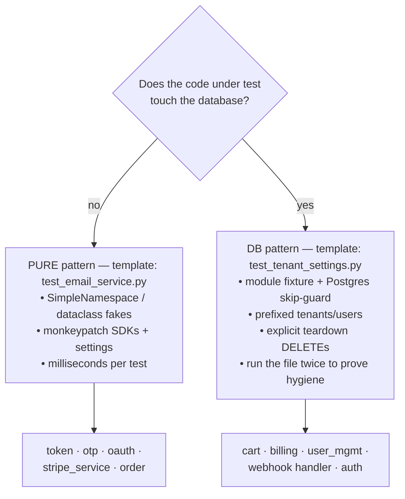

**The DB template, annotated** (this exact skeleton appears in ~10 files now):

```python
PFX = 'CARTSVC-'                                   # unique prefix → teardown can find our rows

@pytest.fixture(scope='module')                    # built ONCE per file
def cart_db():
    from app.core.database import engine, SessionLocal, Base
    try:
        with engine.connect() as conn:
            conn.execute(text('SELECT 1'))
    except Exception as exc:
        pytest.skip(f'No reachable database: {exc}')   # CI without PG? skip, don't fail

    import app.models                              # register all models
    apply_runtime_migrations()                     # idempotent
    Base.metadata.create_all(bind=engine)

    # ... create Tenant + User + test CatalogItems, db.flush() BEFORE
    #     anything that has a foreign key to them ...
    yield SessionLocal, current_user, ids

    # teardown: explicit DELETEs, children before parents (FK order)
    with SessionLocal() as db:
        db.execute(text('DELETE FROM cart_lines WHERE ...'))
        db.execute(text('DELETE FROM carts WHERE tenant_id = :t'), ...)
        ...
```

**Codebase-specific tricks** (each cost us a debugging round — learn them free):

1. **Settings are a cached singleton.** `get_settings()` is `@lru_cache`, so every module-level `settings = get_settings()` is the *same object*. Tests override with `monkeypatch.setattr(settings, 'otp_max_attempts', 2)` — monkeypatch restores it after the test.
2. **Patching staticmethods needs `staticmethod()`:** `monkeypatch.setattr(EmailService, 'send_otp_email', staticmethod(capture))`.
3. **Fake the Stripe SDK at module attributes** — `stripe.Customer.create`, `stripe.checkout.Session.create/retrieve`, `stripe.Webhook.construct_event` — returning `SimpleNamespace`. No network, ever. Real Stripe objects allow both dict *and* attribute access, so webhook fakes use `class FakeStripeObj(dict): __getattr__ = dict.__getitem__`.
4. **`flush()` before FK-dependent inserts.** Relying on SQLAlchemy's insert ordering bit us once (orders → users FK violation); an explicit `db.flush()` after creating users is deterministic.
5. **bcrypt is real and slow** (~0.1–0.3s per hash). The auth test file takes ~10s — *by design*: hash/verify is part of what's under test. Don't fake your crypto.
6. **Same-second JWTs are identical.** Asserting "new access token ≠ old" flakes; assert on the *refresh* token (it carries a new session id).
7. **Test interdependence hides in module fixtures.** Two failures only appeared in full-file runs: leftover OTPs from throttle tests, and a unique constraint (`subscription_id, billing_month`) hit by a second invoice autocreate. Run each DB file standalone *and* the whole suite *twice consecutively*.

### Step 3 — What got tested (and the flows worth understanding)

119 new backend tests across 10 files. The two most instructive flows:

**Auth/OTP state machine** (`test_auth_service.py`, 28 tests — signup, lockout, throttles, refresh rotation, super-admin allowlist):

```mermaid
stateDiagram-v2
    [*] --> Unverified: signup (company email only;<br/>1st on a domain → new tenant + ADMIN,<br/>later → USER, PENDING)
    Unverified --> Unverified: wrong OTP (attempts-1)<br/>5 wrong → OTP locked (429)
    Unverified --> Verified: correct OTP<br/>(+ super-admin promotion if<br/>email is in env allowlist)
    Verified --> SessionActive: login (password or OTP)<br/>throttles - 60s cooldown,<br/>max 3 per 10-min window
    SessionActive --> SessionActive: refresh — ROTATES -<br/>old refresh token revoked;<br/>reusing it → 401
    SessionActive --> [*]: logout (session revoked)
```

Security properties the tests now *prove*: refresh-token reuse is rejected after rotation; the super-admin setup link is **single-use** (the token binds to a fingerprint of the current password state — set a password and the old link dies); the allowlist (`SUPER_ADMIN_EMAILS` env) is the *only* path to SUPER_ADMIN; unknown-email OTP requests are silent (no account enumeration) but audited.

**Stripe webhook idempotency** (`test_stripe_webhook_handler.py`):

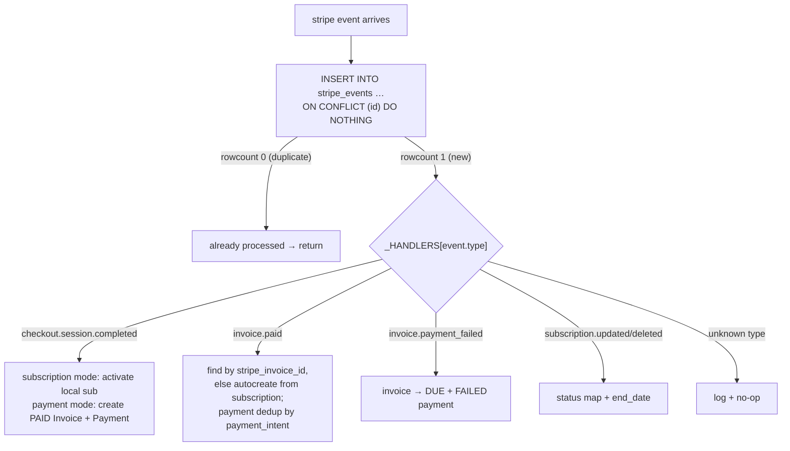

Stripe retries webhooks, so processing the same event twice must equal once — *two* layers here: the event-id insert (whole events) and the `payment_intent` lookup (payments within `invoice.paid`). Both are now tested, including the replay cases.

### Step 4 — Frontend, and the coverage *denominator* game

The suggestions module is **pure logic** (no React, no axios) — plain vitest, no mocking. 38 new tests took `pipeline.ts` from 62.5% → **100%** lines and `generateSuggestedBom.ts` from 0% → covered.

Coverage configuration (in `frontend/vite.config.ts`) is half the battle — *what counts* matters as much as *what's tested*:

```ts
coverage: {
  provider: 'v8',
  include: ['src/calculator/**/*.ts', 'src/suggestions/**/*.ts'],   // framework scope only
  exclude: [
    'src/suggestions/exampleUsage.ts',  // demo data, not a production entry point
    '**/__tests__/**',
    'src/**/types.ts',                  // type-only modules — no executable lines
    'src/**/index.ts',                  // re-export barrels
  ],
  thresholds: {
    // glob-keyed pools: each gated separately
    'src/suggestions/**/*.ts': { lines: 90 },
    'src/calculator/**/*.ts': { lines: 90 },
  },
},
```

Excluding `types.ts`/`index.ts` isn't cheating — they have no executable statements; leaving them in just pollutes the denominator with dead lines (the old report showed them as "0%"). Excluding `exampleUsage.ts` *was* a judgment call, justified by a grep: nothing in `src/` imports it.

### Results

| Metric | Before | After |
|---|---|---|
| Backend suite | 28 failed / 118 passed / 2 skipped | **256 passed** — verified twice in a row *and* against a fresh DB (was 255 + 1 xfail until Bug 2 below was fixed) |
| Backend services+repos | 32% (report) / 46% (greened) | **61%** |
| → auth_service | 0% | 97% |
| → billing / webhook / order | 0% | 98% each |
| → cart | 0% | 96% |
| → stripe / token / otp / oauth | 0% | 100% each |
| → user_management | 0% | 92% |
| Frontend suggestions pool | 74.7% ✗ | **92.8%** ✓ |
| Frontend calculator pool | 92.6% (unenforced) | 92.6% ✓ *enforced* |

### The coverage CI (`tests.yml`) — anatomy

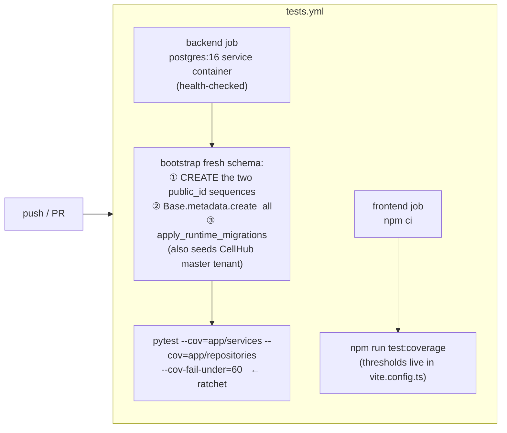

Why the bootstrap step exists (and its exact order): on a **fresh** database, `apply_runtime_migrations()` fails immediately (it `ALTER`s tables that don't exist), and `create_all()` *alone* also fails (the `orders.public_id`/`quotes.public_id` server defaults reference sequences that only migrations create). Sequences → create_all → migrations is the only working order — **verified locally against a literally fresh database** before trusting CI with it (the whole suite then ran all-green on that DB). The only env CI needs: `DATABASE_URL` and `JWT_SECRET_KEY` — the two settings without defaults.

The `--cov-fail-under=60` is a **ratchet** (achieved: 61%). The honest gap to 80% is named: `chatbot_service` (598 lines), `zabbix_client` (299), crew/intake AI modules (~400), `cdw_agent_service` (126), plus deepening partial modules. Raise the ratchet as those land.

> **Lessons:** (1) Green the suite before believing any number it produces. (2) Coverage of 0% means *never executed* — Part 4 shows what hides there. (3) Configure the denominator deliberately and defensibly. (4) Prove your CI recipe locally (fresh DB) before pushing.

---

## Part 4 — The three production bugs, dissected

All three lived **exclusively in 0%-coverage code**. This is the strongest argument for the whole coverage effort.

### Bug 1 — Every Stripe webhook crashed (fixed inline)

`stripe_webhook_handler._record_event` used:

```python
text("INSERT INTO stripe_events (id, type, payload) "
     "VALUES (:id, :type, :payload::jsonb) "          # ← the bug
     "ON CONFLICT (id) DO NOTHING")
```

SQLAlchemy's `text()` parses bind params with a regex — and a param immediately followed by a Postgres `::cast` is misparsed. Reproduced in isolation:

```python
>>> stmt = text('INSERT INTO t (id, payload) VALUES (:id, :payload::jsonb)')
>>> stmt._bindparams.keys()
dict_keys(['id', 'payloa'])        # ← it bound a param named 'payloa'!
```

So `:payload` reached Postgres as a literal string → `syntax error at or near ":"` → **every** incoming webhook 500s before reaching any handler. Fix (one line):

```python
"VALUES (:id, :type, CAST(:payload AS jsonb)) "
```

Why fix it inline when the session was "tests only"? Because every webhook test depended on it — and a one-line, obviously-correct fix that your new tests immediately verify is exactly what test-writing is *for*. **Takeaway:** in SQLAlchemy `text()`, write `CAST(:param AS type)`, never `:param::type`.

### Bug 2 — Webhook subscription-autocreate violated NOT NULL (xfail → follow-up → fixed)

When `checkout.session.completed` (subscription mode) arrived with no matching local subscription, the handler built `Subscription(contract_id=None, ...)` — but `subscriptions.contract_id` was `NOT NULL` (FK to contracts). The insert raised `IntegrityError`; that branch had *never* succeeded. The fix was a product decision (nullable column? auto-create a contract? skip-and-log?), so the coverage session did **not** decide it unilaterally. Instead it pinned the bug:

```python
@pytest.mark.xfail(reason='BUG: handler builds Subscription(contract_id=None) but '
                          'subscriptions.contract_id is NOT NULL — branch crashes',
                   raises=Exception, strict=True)
def test_checkout_subscription_creates_missing_local_sub(...):
```

`strict=True` means: when someone fixes the bug, this test *fails* ("XPASS") — forcing them to turn it into a real test. **That is exactly what happened**: a follow-up task made `contract_id` nullable (model change + a `DROP NOT NULL` runtime migration — a tenant-level Stripe checkout subscription legitimately has no local order/contract behind it), and the xfail became a real passing test asserting `sub.contract_id is None`. The mechanism worked end-to-end: bug found by new tests → documented as strict xfail → fixed in a scoped follow-up → test promoted.

### Bug 3 — The app couldn't boot a fresh database (CI had the cure; since fixed)

`app/main.py`'s startup runs `apply_runtime_migrations()` **before** `create_all()`. On a fresh database that explodes immediately (`ALTER TABLE users …` — no such table). And the naive "just swap them" also fails: `create_all` needs `order_public_id_seq`/`quote_public_id_seq`, which only migrations create. The proven order (now living in `tests.yml`, verified against a real fresh DB):

```python
with engine.begin() as conn:
    conn.execute(text("CREATE SEQUENCE IF NOT EXISTS quote_public_id_seq"))
    conn.execute(text("CREATE SEQUENCE IF NOT EXISTS order_public_id_seq"))
Base.metadata.create_all(bind=engine)
apply_runtime_migrations()      # also seeds the CellHub master tenant
```

Nobody noticed because every existing environment's DB predates the change. A follow-up task has since applied this exact ordering to the startup hook in `app/main.py`, so a fresh deploy now boots cleanly. **Takeaway:** "works on every machine we have" ≠ "works from zero". CI with a fresh service container is what catches this class.

---

## Part 5 — The meta-process (how each workstream actually ran)

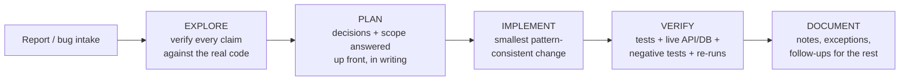

Concrete instances of each stage, from this session:

- **Explore — reports lie (innocently).** The coverage report's 32% was measured on a broken suite. `DEPENDENCY_UPGRADE_NOTES.md` *described* an axios fix that had never been applied (`package.json` still said `^1.11.0`). The bandit report predated the logging system and missed two findings. *Always reproduce the numbers yourself.*
- **Plan — surface the real decisions.** Each plan had 2–3 genuine forks ("fix gates now or with the write path?", "ratchet or red CI?", "P0 only or P0+P1?") that were decided *before* code, with reasoning recorded.
- **Implement — find the pattern first.** Tenant context, the two test templates, the `# nosec` style — every change copied an existing convention. New conventions are a cost; pay it only deliberately.
- **Verify — to the bottom.** Cross-tenant write checked in Postgres, not just the API response. CI bootstrap run against a literally fresh DB. Security gates negative-tested. DB test files run twice consecutively.
- **Document — especially what you *didn't* do.** SECURITY_NOTES exceptions with re-check triggers; the strict xfail; the honest 61%-vs-80% gap with the named remaining modules; follow-up task chips for the two unfixed bugs.

---

## Appendix A — Run it yourself (command reference)

```bash
# ── Backend tests ────────────────────────────────────────────────
cd backend
.venv/bin/python -m pytest -q                          # full suite (~15s)
.venv/bin/python -m pytest tests/test_auth_service.py -q   # one file
.venv/bin/python -m pytest -q --cov=app/services --cov=app/repositories \
    --cov-report=term-missing                          # coverage + uncovered lines

# ── Security gates (exactly what CI runs) ───────────────────────
.venv/bin/bandit -r app -ll -iii                       # SAST
.venv/bin/pip check                                    # resolver consistency
.venv/bin/pip freeze > /tmp/freeze.txt && \
  <separate-env>/bin/pip-audit -r /tmp/freeze.txt --no-deps   # SCA (pip-audit lives outside the venv)

# ── Frontend ─────────────────────────────────────────────────────
cd ../frontend
npm test                                               # vitest
npm run test:coverage                                  # + thresholds (fails <90% pools)
npm audit --audit-level=high                           # SCA gate

# ── Live smoke (dev servers on :8000 / :5173) ───────────────────
curl -s http://localhost:8000/health
TOKEN=$(curl -s -X POST http://localhost:8000/auth/login \
  -H 'Content-Type: application/json' \
  -d '{"email":"<user>","password":"<pass>"}' | python3 -c "import json,sys;print(json.load(sys.stdin)['access_token'])")
curl -s http://localhost:8000/users/me -H "Authorization: Bearer $TOKEN"
curl -s http://localhost:8000/onboarding/profile \
  -H "Authorization: Bearer $TOKEN" -H "X-Tenant-Id: <tenant-uuid>"   # cross-tenant read
```

Useful fixture knowledge: `backend/scripts/reset_design_test_data` reseeds the design-flow tenants; `scripts/seed_test_tenants` creates companies with completed onboarding.

## Appendix B — File map & glossary

| Artifact | Path |
|---|---|
| Tenant-context seam (read this first) | `backend/app/middleware/tenant_context.py` |
| Onboarding fix | `backend/app/{routes,services}/onboarding*.py`, `routes/users.py`, `frontend/src/components/shop/ShopShell.tsx` |
| Security reviews + accepted exceptions | `backend/SECURITY_NOTES.md` |
| Bandit config / dev deps | `backend/.bandit`, `backend/requirements-dev.txt` |
| CI workflows | `.github/workflows/security.yml`, `.github/workflows/tests.yml` |
| Frontend coverage config | `frontend/vite.config.ts` |
| DB-test template | `backend/tests/test_tenant_settings.py` |
| Pure-test template | `backend/tests/test_email_service.py` |
| The big auth test (worth reading end-to-end) | `backend/tests/test_auth_service.py` |
| Dependency upgrade record | `DEPENDENCY_UPGRADE_NOTES.md` |

| Term | Meaning |
|---|---|
| Home / effective tenant | JWT tenant vs the tenant a request acts on (`X-Tenant-Id`, SUPER_ADMIN only) |
| SCA / SAST | Dependency vulnerability scanning / own-code static analysis |
| `~=X.Y.Z` | "Compatible release" pin: ≥X.Y.Z but <X.(Y+1) — the reason some CVEs are un-fixable here |
| `# nosec BXXX` | Inline, justified bandit suppression; rule-wide skips are banned |
| Fixture drift | Test fakes falling behind evolving real models |
| Module-scoped fixture | Per-test-file setup/teardown, this codebase's standard (no conftest.py) |
| Ratchet threshold | CI coverage gate at achieved level, raised toward the target over time |
| strict xfail | A test that documents a known bug and goes red the moment the bug disappears |
| Idempotency (webhooks) | Same event twice = effect of once (`stripe_events` insert + `payment_intent` dedup) |
| Refresh-token rotation | Each refresh revokes the old session and mints a new one; reuse of the old token → 401 |
| Master tenant | CellHub's own tenant (`…00c1`), home of internal operators, seeded by migrations |
